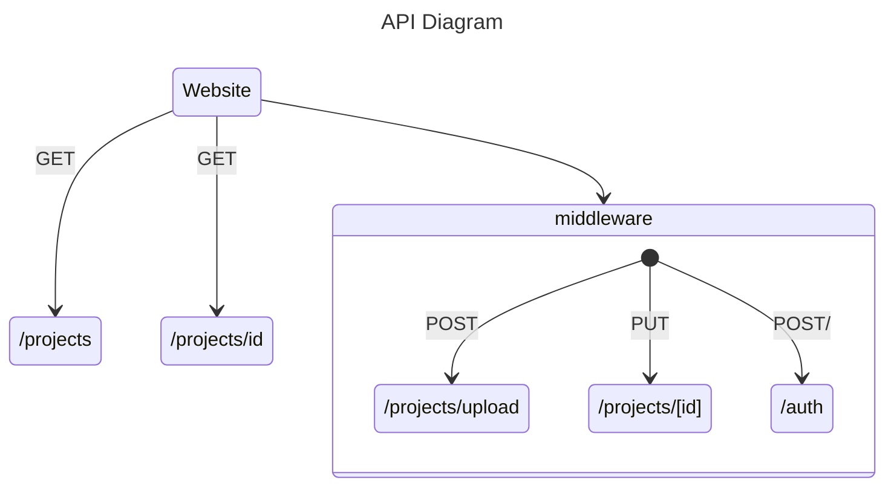

# Learn a Language: Go/Golang
## Aidan Jimenez | 5/9/25
[Video Demo Link](https://drive.google.com/file/d/1ahsxhuOR0vWZ5I4syl_U36z9w8RJuCDn/view?usp=sharing)

### Language Specifications
- Generation: 3rd
- Level: High Level
- Compiled Language
- Paradigm: OOP and Imperative
- Procedural

## Project Description
I chose Go since I had heard that it was a pretty fast and effective
language.It had also interested me since it seemed like there were some nice
capabilities when writing API's and this proved true while writing the API for
a website. I also thought that this would be a great opportunity to learn the
language as it can be a good thing to add to my resume in the future as I learn
the language more.

The project I decided to write was an API for a website that I had written in
my Web Development class last semester. The website was not fully done and the
API was previously written in JavaScript which was only partially functional
and got messy. So during this project I had to finish writing both the frontend
and backend which was where I used Go. The website is a portfolio for a
production company that I started with some friends and is aimed at hosting
projects so that future clients can see our work. To make this more efficient
made this API which we can use to upload the images from these projects and
some basic information. Additionally, I had to implement a authentication
sequence so that random users cannot just upload and delete projects that are
displayed on the site. Where Go came in effective was that the API endpoints
can have "middleware" which would allow some of these endpoints to have a
validation function that can validate that there is an authorized user making
these requests. One of the main packages that I used to make this API was "gin"
which is advertised to make an http web framework or API. Below is a diagram of
the endpoints and methods that are available in the api.


These endpoints above are how the website is able to communicate with the API.
The endpoints which use the GET method do not require a person to be authorized
since it allows any user to view projects. As previously mentioned the rest of
the endpoints are required to go through this middleware. In the case of Go I
was able to write this code below:
```go
	projects := rg.Group("/projects")
	projects.GET("/", controllers.GetProjects)
	projects.PUT("/:id", authenticateMiddleware, controllers.EditProject)
	projects.GET(":id", controllers.GetProjectByID)
	projects.POST("/upload", authenticateMiddleware, controllers.UploadProject)
	projects.DELETE("/:id", authenticateMiddleware, controllers.DeleteProject)
```
To break down what this is doing I'll start with the `rg.Group` which is making
a group of url endpoints which are under the `/projects/` path. Then I am able
to do `.GET, .POST, etc` to declare the HTTP method that I want to use and then
the rest of the endpoint which in some cases are `:id` which can take in
whatever is input there to use in the functions later on where I am able to
parse them. Next is the methods that I call, so for the endpoints where I need
to use the middleware I can call the function `authenticateMiddleware` and in
that function I go through the authorization header and validate the JWT token
that I am sending from the frontend of the website. The way I had to implement
this was not the norm but I was having a lot of issues when trying to send back
the `Set-Cookie` header so I used this as my work around for the project. I am
then able to call the controller which just calls other functions and does not
contain logic. These controllers call the services which then allow me to run
any required logic that is needed.

Another aspect of this project was the way that I implemented the storage of
these projects. I used a json file since it was easy to use for testing and
allowed me to use similar logic to what is on the frontend to read the data. Go
does not have a direct way to do this so you have to build a struct which I can
then use the `encoding/json` package to `Marshal` and `Unmarshal` these json
objects. Which is the purpose of the `models/` directory, it just contains two
structs that are a copy of the json object but in a way that Go can interpret
them. In the code snippet below you can see how that looks. Additionally, I
would like to mention how Go is statically typed but can also infer what the
type is which is great at writing code quickly.

```go
type Project struct {
	ID        	int64	`json:"id"`
	ProjectTitle  string   `json:"projectTitle"`
	ClientName	string   `json:"clientName"`
	Category  	string   `json:"category"`
	ProjectStills []string `json:"projectStills"`
	Description   string   `json:"description"`
	ProjectLink   string   `json:"projectLink"`
}
```


### Additional Language Features
Go is a programming language designed by Google. It is similar to C since there
are pointers and addresses that you can use which work exactly the same as C.
An example in my code would be the input of the from the gin package where I
have the parameter `c *gin.Context` in my API calls. Though I did not use
interfaces they exist in the language and lean more into the object oriented
paradigm. An interesting aspect of the language was that the way to declare
whether a variable, function, struct, etc. is public or private, Go determines
this with the use of a capital in the beginning of the name. For instance if I
name a variable `myVariable` then it would be private but if I named it
`MyVariable` it would be public. There was a cool feature in Go that allowed me
to make an `init` function in any of my files and when the program is ran it
will automatically run those function to initialize functions and things like
that which allowed me to initialize both public and private variables
throughout my projects. The language is statically typed and requires you to
declare types though if you are making a new variable and just want to declare
it without a type you can use the `:=` syntax. Another feature in Go is if you
go to compile with an import that is not used you will not be able to run the
program.
